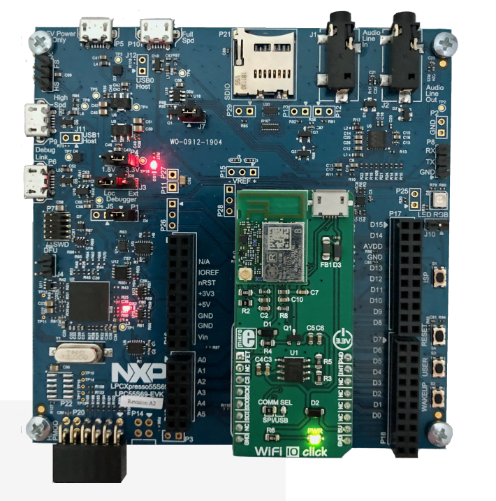

# SerwisPogodowy
## Pobieranie danych z serwisu OpenWeatherMap
   Nalezy wejść na https://openweathermap.org/, założyc darmowe konto i wygenerowac API key który bedzie nam potrzebny do uzyskiwania danych pogodowych.
   Podłącz moduł WiFi do złącza mikroBUS na płycie prototypowej. 
   
   
   Dodaj swój {API key} do linku w metodzie GET
   ```

while (1)
{
   httpGet("api.openweathermap.org/data/2.5/weather?q=Tarnow,pl&APPID={APIKEY}", recvData);
   
   char *contentData=recvData;
   int recvLen=strlen(recvData);
   
   http_head_parser(recvData, vbuff, "Content-Length:");
   int contLen=atoi(vbuff);
   contentData=recvData+(recvLen-contLen);
   
   PRINTF("%s\r\n\r\n", contentData);
   vTaskDelay(MSEC_TO_TICK(5000));
}

   
   ```
### Technologies:
Project is created with:
* JSON
* Weather API
* C


```
#define AP_SSID "C111"
#define AP_PASSPHRASE "abcdefabcdef987654321"
QCOM_SSID g_ssid = {.ssid = (AP_SSID)};
QCOM_PASSPHRASE g_passphrase = {.passphrase = (AP_PASSPHRASE)};
WLAN_AUTH_MODE g_auth = WLAN_AUTH_WPA2_PSK;
WLAN_CRYPT_TYPE g_cipher = WLAN_CRYPT_AES_CRYPT;
```
